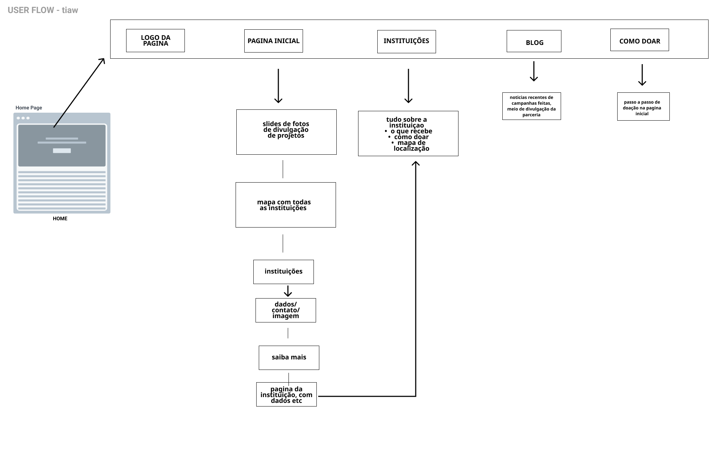
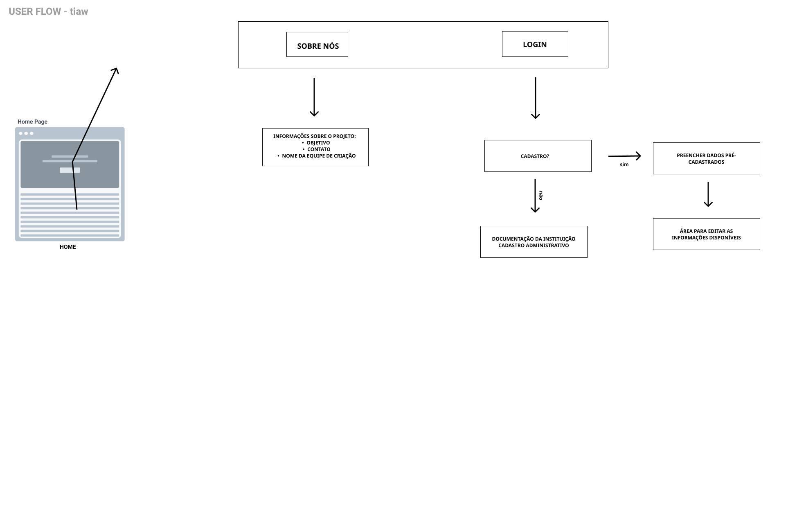
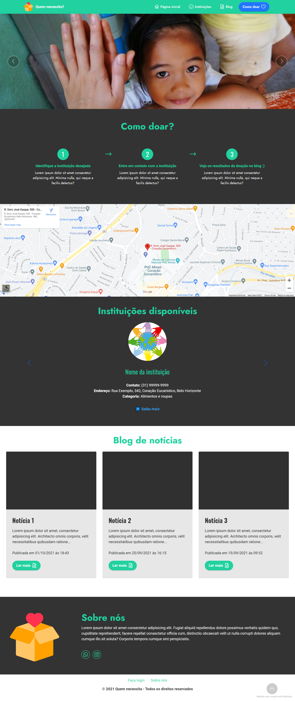

# Projeto de interface

Para a elaboração do wireframe e protótipo interativo, a equipe utilizou da plataforma de criação de sites low-code **Mobirise**, que permitiu um esboço fiel do resultado almejado.

Para a elaboração do user-flow, a equipe utilizou da paltaforma **Figma**, que permitiu o design seguindo precisamente o protótipo interativo.

> O protótipo pode ser acessado a partir do link: https://httpspedroh.github.io/quem-necessita/

  
## User-flow

  

## Wireframe

